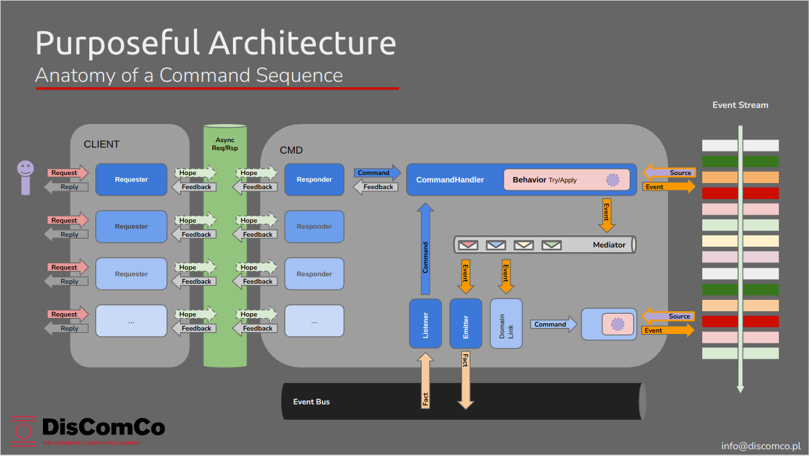
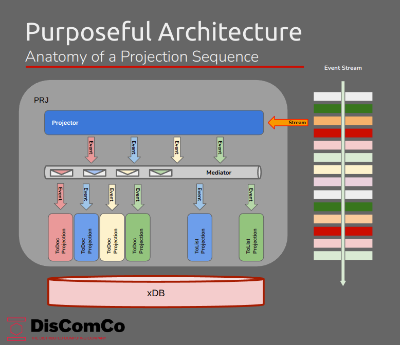
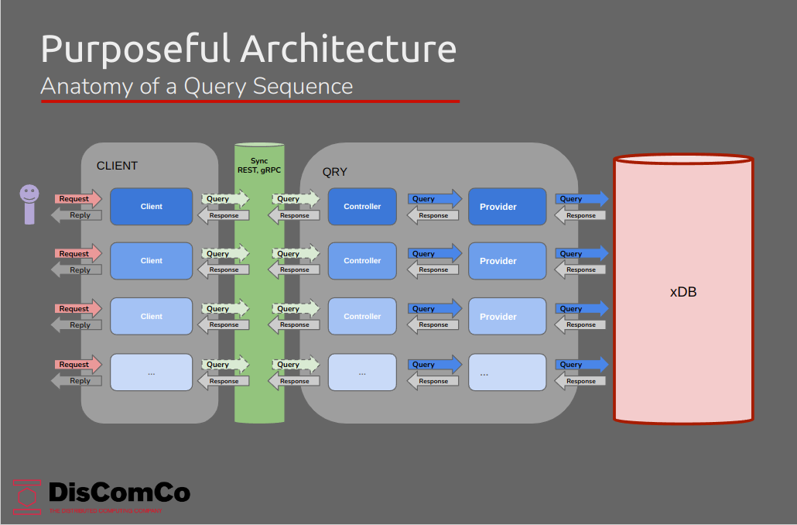
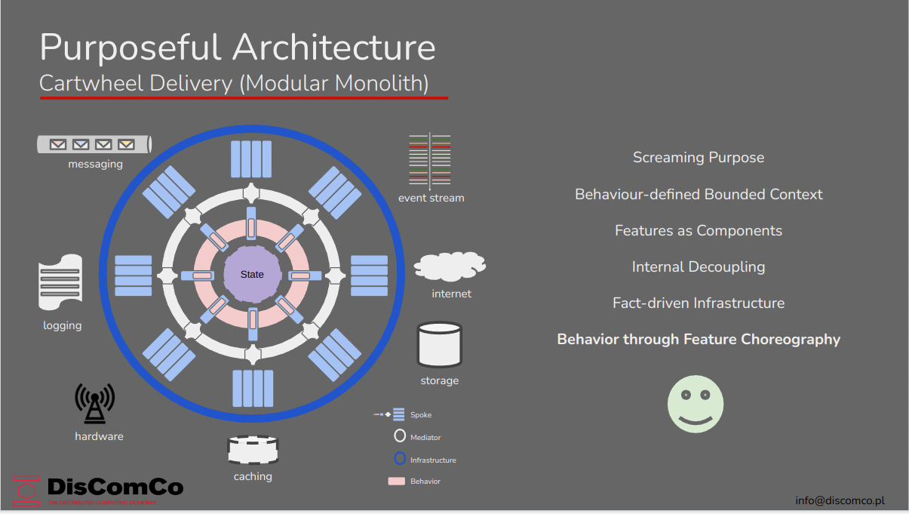
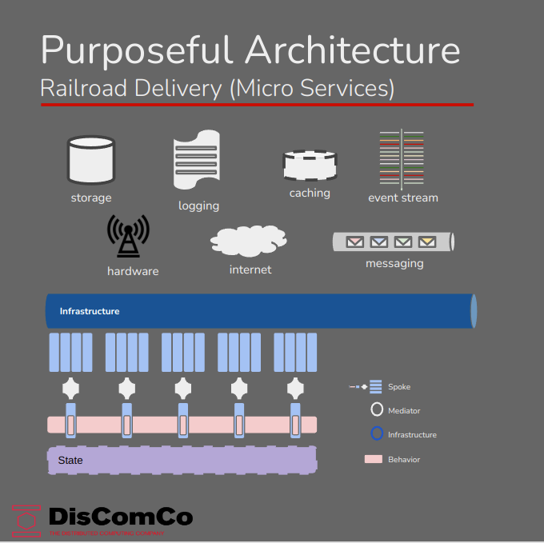

# The GO-CART SDK

## OUTLINE

- [The GO-CART SDK](#the-go-cart-sdk)
  - [OUTLINE](#outline)
  - [DESCRIPTION](#description)
  - [MOTIVATIONS](#motivations)
  - [WHAT IS PURPOSEFUL ARCHITECTURE?](#what-is-purposeful-architecture)
  - [STRUCTURE OF GO-CART Applications](#structure-of-go-cart-applications)
    - [Command Sequence](#command-sequence)
    - [Projection Sequence](#projection-sequence)
    - [Query Sequence](#query-sequence)
  - [UNIT OF DEPLOYMENT](#unit-of-deployment)
    - [Cartwheel Deployment](#cartwheel-deployment)
    - [Railroad Deployment](#railroad-deployment)
  - [DEVELOPING GO-CART Applications](#developing-go-cart-applications)
    - [Default Dependencies](#default-dependencies)
    - [On the Roadmap](#on-the-roadmap)
    - [Setting up the local development environment](#setting-up-the-local-development-environment)
    - [Reference Implementation](#reference-implementation)
  - [SOME REFERENCES](#some-references)
  - [SERVERLESS DEPLOYMENT](#serverless-deployment)


## DESCRIPTION
This SDK provides a basis for developing modular applications for EventSourcing/CQRS in Golang, using Purposeful Architecture.

## MOTIVATIONS
- as a **Software Engineering Manager**
  - I require **a way to normalize the software manufacturing process** 
  - so that **software creation becomes a predictable, repeatable and scalable activity, both in velocity and quality**
- as a **Software Architect**
  - I want to be able **to provide a unified approach to solving non-functional requirements** 
  - and **empower software engineers with tools that minimize boilerplate code**
  - and **offer tools that normalize the software manufacturing process**
  - in order to **provide a consistent level of quality**
  - and **achieve a predictable manufacturing process**
- as a **Software Engineer**
   - I require **a set of base artifacts and patterns**
   - so I will **be able to focus on implementing business logic**
   - and **not have to worry about non-functional requirements**
   - and can **avoid to implement recurring boilerplate code**


## WHAT IS PURPOSEFUL ARCHITECTURE?

> [Purposeful Architecture](https://dev.to/discomco/purposeful-architecture-requirements-13ad) is an architectural style, that is derived from _Screaming Architecture_, with a strong focus on communicating the intent of the application to all stakeholders. 
> 
> Additionally, it builds on the concept of [Inverted Architecture](https://dev.to/discomco/inverted-architecture-the-state-of-the-art-31hi) and relies heavily on composition, internal decoupling and reactive design.
> 
> This results in a very modular codebase that offers great flexibility in the choice of Unit of Deployment. 
> 
> GO-CART applications can be deployed as either Modular Monoliths (Cartwheel deployment) or Micro Services (Railroad deployment) and we are investigating options for serverless deployment as well. (OpenFaaS)


## STRUCTURE OF GO-CART Applications

This SDK produces applications that are modular, based on reactive (behavior-centric) design, immutable architecture (Event Sourcing/CQRS) and choreography.
This means that these applications implement a process logic, rather than just "dumb" data-structures and that there are two different models in play: the behavioral (write) model, that identifies events and commands and the static (read) model that represents the data structures. 
*Event Storming* has proven to be a useful technique for discovering behavior, while *Domain Driven Design* is best fit for discovering the static model.
Additionally, such applications need to implement three data-flows: *COMMANDS, PROJECTIONS and QUERIES*.

### Command Sequence



### Projection Sequence



### Query Sequence



## UNIT OF DEPLOYMENT

### Cartwheel Deployment



### Railroad Deployment




## DEVELOPING GO-CART Applications

### Default Dependencies

The GO-CART SDK defaults to the use of these backend services:

- [EventStoreDB](https://www.eventstore.com/eventstoredb)
- [Core NATS](https://nats.io/)
- [Redis](https://redis.io/)

### On the Roadmap

We are aiming to implement drivers to integrate with 

- [RabbitMQ](https://www.rabbitmq.com/)
- [Kafka](https://kafka.apache.org/)
- [Elastic](https://www.elastic.co/)


### Setting up the local development environment

For local development, we recommend the [compose-dev-stack](https://github.com/rgfaber/compose-dev-stack). 

<br>

usage:
```bash
git clone https://github.com/rgfaber/compose-dev-stack
./run-minimal.sh -d
```

### Reference Implementation

We are working on training material, but for now, 
please check out the *./examples* folder for reference implementations.


## SOME REFERENCES
- [Event Sourcing/CQRS - Greg Young](https://youtu.be/8JKjvY4etTY)
- [Event Storming - Alberto Brandolini](https://youtu.be/mLXQIYEwK24)
- [Microservices - Allard Buijze](https://youtu.be/jrbWIS7BH70)


## SERVERLESS DEPLOYMENT
One may notice that this architecture, due to its decoupled and modular nature, has many similarities with the concept of **Functions as a Service** (FaaS). One of the major issues that FaaS platforms struggle with is how to implement event sourced systems. This architecture does not pretend to have the solution for this problem, but **Behavior Composition** may offer a path forward. Should decomposing the Screaming Monolith into functional nanoservices become an option or a necessity one day, packaging each feature as a function and deploying it to a "serverless" infrastructure like OpenFaaS, should require minimal effort.