# The GO-SCREAM SDK

## TABLE OF CONTENTS
- [The GO-SCREAM SDK](#the-go-scream-sdk)
  - [TABLE OF CONTENTS](#table-of-contents)
  - [DESCRIPTION](#description)
  - [MOTIVATIONS](#motivations)
  - [DEFINITIONS](#definitions)
    - [Screaming Architecture](#screaming-architecture)
    - [The Screaming Monolith](#the-screaming-monolith)
    - [Injectors](#injectors)
      - [Example](#example)
    - [Injections](#injections)
        - [Example](#example-1)
    - [Event Storming](#event-storming)
      - [Events](#events)
      - [Commands](#commands)
      - [Big Picture](#big-picture)
      - [Context](#context)
    - [Domain Driven Design (DDD)](#domain-driven-design-ddd)
      - [Identity](#identity)
      - [Aggregate Root](#aggregate-root)
      - [Entity](#entity)
      - [Value Object](#value-object)
    - [The Aggregate](#the-aggregate)
  - [GO-SCREAM Applications](#go-scream-applications)
  - [ANATOMY of a GO-SCREAM Application](#anatomy-of-a-go-scream-application)
    - [Model [/model]](#model-model)
    - [Domain [/domain/{feature}]](#domain-domainfeature)
      - [for CMD Applications](#for-cmd-applications)
      - [for PRJ Applications](#for-prj-applications)
      - [for QRY Applications](#for-qry-applications)
    - [Features [/features/{feature}]](#features-featuresfeature)
      - [for CMD Applications](#for-cmd-applications-1)
      - [for PRJ Applications](#for-prj-applications-1)
      - [for QRY Applications](#for-qry-applications-1)
    - [Dtos [/dtos/{feature}]](#dtos-dtosfeature)
    - [Containers [/containers/{feature}]](#containers-containersfeature)
    - [Drivers [/drivers/{tech}]](#drivers-driverstech)
  - [Sequences](#sequences)
    - [Command Sequence (CMD)](#command-sequence-cmd)
      - [Choice of Technology](#choice-of-technology)
      - [Definition of Feature](#definition-of-feature)
      - [Step 1: Request](#step-1-request)
      - [Step 2: Receiving the IHope request](#step-2-receiving-the-ihope-request)
      - [Step 3: Handling the ICmd](#step-3-handling-the-icmd)
        - [A few words on Idempotency](#a-few-words-on-idempotency)
      - [Internal Event Processing](#internal-event-processing)
        - [Domain Links](#domain-links)
        - [Emitters](#emitters)
      - [Integrations](#integrations)
    - [Projection Sequence](#projection-sequence)
      - [Step 1: Extraction](#step-1-extraction)
      - [Step 2: Transformation](#step-2-transformation)
      - [Step 3: Load](#step-3-load)
  - [DEVELOPING GO-SCREAM Applications](#developing-go-scream-applications)
    - [Setting up the local development environment](#setting-up-the-local-development-environment)
  - [SOME REFERENCES](#some-references)
  - [SERVERLESS DEPLOYMENT](#serverless-deployment)

## DESCRIPTION
This SDK provides a basis for developing modular applications for EventSourcing/CQRS in Golang

## MOTIVATIONS
- as a **Software Engineering Manager**
  - I require **a way to normalize the software manufacturing process** 
  - so that **software creation becomes a predictable, repeatable and scalable activity, both in velocity and quality**
- as a **Software Architect**
  - I want to be able **to provide a unified approach to solving non-functional requirements** 
  - and **empower software engineers with tools that minimize boilerplate code**
  - and **offer tools that normalize the software manufacturing process**
  - in order to **provide a consistent level of quality**
  - and **achieve a predictable manufacturing process**
- as a **Software Engineer**
   - I require **a set of base artifacts and patterns**
   - so I will **be able to focus on implementing business logic**
   - and **not have to worry about non-functional requirements**
   - and can **avoid to implement recurring boilerplate code**

## DEFINITIONS
### Screaming Architecture
>**Screaming Architecture** advocates the clear communication of purpose, where artifacts are immediately recognizable by all stakeholders. 

This leads to implementations where **modularity** becomes a key priority and encourages the creation of applications by composition, using **dependency injection**, producing "Screaming Monoliths", a form of Modular Monolith, where the bounded context is defined by dynamic behavior models (the process), rather than static domain models. 

- This SDK supports the **Screaming Architecture** paradigm, in combination with **Event Sourcing/CQRS** and **Feature Slicing**, which results in a modular application. 
- Modules inside this monolith are decoupled and act as internal nanoservices that communicate over an internal eventbus aka the *Mediator* 
- For the DI part, we opted to use [uber-go/dig](https://github.com/uber-go/dig), while leveraging [golang generics](https://go.dev/doc/tutorial/generics) to implement recurring application patterns.

### The Screaming Monolith
>**Is a modular application that combines the principles of Clean Architecture with Feature Slicing (aka Vertical Slicing), where each slice must be internally decoupled and individually testable.**

The intent of the application must become clear to all stakeholders, at first glance.
The outcome is a modular application, in which each of the components is independent from the rest of the system, 
whilst internal communication is achieved using the **Mediator Pattern**

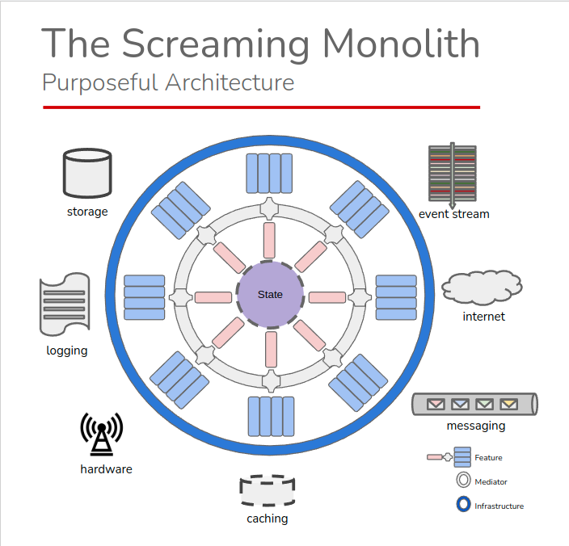 

### Injectors


>**Injectors** or **Injection Discriminators** are *declaration artifacts* that
>- allow for type-based DI injection and resolution, leveraging go generics, 
>- allow us to reason about and implement application patterns, while injecting concrete implementations afterwards. 
>- enforce clean architecture, as they are defined in a shell that is deeper in relation to their usage.
>
>**Injectors in go-scream applications are identified by the "I" prefix and declared using the *interface* keyword.**

**Please Note** Though declared as *interface* types, injectors should not be thought of in the idiomatic "golang way". They are intended to  enforce certain architectural patterns and are not just abstraction placeholers.

#### Example
Consider
```golang
package add_session
//IApplyEvt is the injector for add_session.ApplyEvt
type IApplyEvt interface {
	domain.IApplyEvt
}

// ITryCmd is the injector for add_session.TryCmd
type ITryCmd interface {
	domain.ITryCmd
}
```
and (from the GO-SCREAM SDK)
```golang
package domain

//IAggPlugin (Aggregate Plugin) is an injector that allows us to inject ITryCmd and IApplyEvt injectors into the Aggregate in an elegant way.
type IAggPlugin interface {
	AggregateSetter
}

// IApplyEvt is an IAggPlugin injector that allows us to inject Event Appliers into the Aggregate
type IApplyEvt interface {
	IAggPlugin
	EvtTypeGetter
	ApplyEvent(evt IEvt, state model.IState) error
}

// ITryCmd is an IAggPlugin injector that allows us to inject Command Executors into the Aggregate
type ITryCmd interface {
	IAggPlugin
	CmdTypeGetter
	TryCommand(ctx context.Context, command ICmd) (IEvt, IFbk)
}

```

### Injections
Given the functional nature of golang, we will need an actual function to be injected into the DI container. 
This is the purpose of **injections**.
>**Injections** are *implementation artifacts* that return a concrete implementation for an injector
##### Example
```golang
package add_session
//ApplyEvt is the injection for add_session.ApplyEvt. 
//It returns a domain.IAggPlugin injector that will be resolved to add_session.IApplyEvt 
func ApplyEvt() domain.IAggPlugin {
	return newApplyEvt()
}

//TryCmd is the injection for add_session.ITryCmd
//It returns a domain.IAggPlugin that will be resolved to add_session.ITryCmd
func TryCmd() domain.IAggPlugin {
	return newTryCmd()
}
```
### Event Storming
>**Event Storming** is a *discovery practice* that is rapidly gaining momentum in the industry, because of its inclusive and intuitive nature. Its aim is to discover the expected **behaviour** of systems under design. This is done in low-tech, semantically liberal workshops where domain- as well as technology experts participate in *event-centric* brainstorming. The outcome of these sessions are a Context Map (aka 'Big Picture') and a number of *Contexts* which describe the processes and their interactions with users, other contexts or external systems.

There is some jargon involved, which we shall briefly clarify.
#### Events
#### Commands
#### Big Picture
#### Context

### Domain Driven Design (DDD)
>**DDD** is a popular *discovery practice* that offers the tools to reason and analyse the static data  >structures of a business domain. 

There is some jargon involved, which we shall briefly clarify:
#### Identity
By convention, we identify an *IDentity* as a structured type that has a prefix and a value and in code, variables that represent IDentity types have the 'ID' suffix (i.e. carID). The string representation of an IDentity always has the form "prefix-value" and those variables can be recognized in code by their 'Id' suffix (i.e. carId).  
#### Aggregate Root
#### Entity
#### Value Object
### The Aggregate

>**The Aggregate** in event sourced applications is the equivalent of the ActiveRecord in classic CrUD (Create, Upsert, Delete) applications.
>It truly is the heart of an ES system, that unites State and Behavior.
>Its main responsibilities are:
> 1. to build a (volatile) State from an ordered list of previously committed Events, that are sourced from the Event Stream that is identified by the AggregateID.
> 2. Accept Command requests and apply business logic that checks whether the Command (ICmd) is allowed to be executed or not, according to a number of Specifications, the Current State of the Aggregate and the Command's payload.
> 3. If Command execution is allowed, Raise a new Event and Apply it to itself, as to update the Current State to the New State.

Specifically for GO-SCREAM CMD Applications, given their modular nature, we rely on *Aggregate Composition*.
>**Aggregate Composition** is a technique that allows us to inject the IApplyEvt and ITryCmd injectors, in order to compose an Aggregate that has all the capabilities required to process the full Event Stream.

from the GO-SCREAM SDK:
```golang
// IAggregate is the injector for Aggregates
// In an Event Sourced application, the Aggregate can be considered as the equivalent of the ActiveRecord in classic CrUD (Create, Upsert, Delete) applications.
// The Aggregate can be considered as the heart of an ES system, that unites State with Behavior.
// Its main responsibilities are:
//  1. to build a (volatile) State from an ordered list of previously committed Events, that are sourced from the Event Stream that is identified by the AggregateID.
//  2. Accept Command requests and applying business logic that checks whether the Command (ICmd) is allowed to be executed or not,
//     according to a number of Specifications, the Current State (see 1.) and the Command's Payload
//  3. If Command execution is allowed, Raise a new Event and ApplyEvent it to itself, as to update the Current State to the New State.
// Specifically for GO-SCREAM CMD Applications, given their modular nature, we rely on Aggregate Composition.
// Aggregate Composition is a technique that allows us to inject
// a series of AggPluginFtor functors that create a feature's IApplyEvt and ITryCmd injectors,
// in order to compose an Aggregate that has all the capabilities required to process the Event Stream.
type IAggregate interface {
	ISimpleAggregate
	Inject(agg IAggregate, actors ...AggPluginFtor) IAggregate
	KnowsCmd(topic CommandType) bool
	KnowsEvt(topic EventType) bool
}

// ISimpleAggregate is an injector that abstracts the implementation of a traditional monolithic Aggregate.
type ISimpleAggregate interface {
	AggregateTypeGetter
	String() string
	TryCommand(ctx context.Context, command ICmd) (IEvt, IFbk)
	ApplyEvent(event IEvt, isCommitted bool) error
	GetState() model.IState
	GetUncommittedEvents() []IEvt
	ClearUncommittedEvents()
	SetAppliedEvents(events []IEvt)
	GetAppliedEvents() []IEvt
	ToSnapshot()
	RaiseEvent(event IEvt) error
	GetVersion() int64
	GetID() core.IIdentity
	SetID(identity core.IIdentity) IAggregate
}

```

## GO-SCREAM Applications
There are 3 types of go-scream applications: 

>- **Command (CMD)** applications  
>   - accept and evaluate commands and 
>   - write the resulting events to the EventStore
>- **Projection (PRJ)** applications
>   - extract events from the EventStore by subscribing to relevant streams, 
>   - transform the events to a read model and 
>   - load the result onto the read-dedicated data store(s) and cache(s)
>- **Query (QRY)** applications
>   - execute query requests and 
>   - return the results
  
All have the same basic structure: they are composed of function-specific features. CMD apps are composed of CmdFeatures, PRJ apps have PrjFeatures and QRY apps have QryFeatures.

## ANATOMY of a GO-SCREAM Application
As stated before, a GO-SCREAM application builds on the principles of Clean Architecture,
which means that **dependencies point inwards**. We can visualize this as follows:

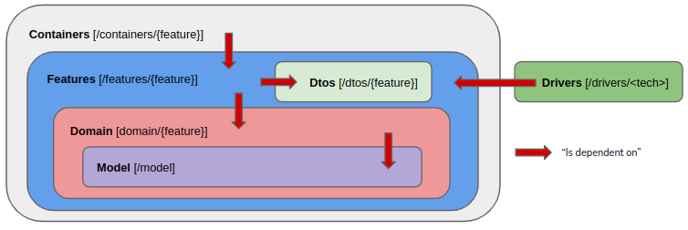

We will now describe these different shells from the inside out, which also the recommended order for developing GO-SCREAM Applications. 
>**Developers are expected to start with the model package and work their way outwards, in a test-driven manner!**
### Model [/model]
- At the core of a an applications sits the **model**, which contains the static data structures that represent the state of information in the system. These are **POGOS** (Plain Old GO Structures), that implement the data model. In this layer, we use DDD terminology to reason about things like aggregate *root* objects, *entities* that have an *IDentity* and *Value Objects*, which are structs without identity. 
> **Model artifacts reside in the /model package**
### Domain [/domain/{feature}]
- The Domain shell is the heart of application. This is where the behavior or business logic is implemented. This is the *only* place in the application where logic should be implemented.   
> **Domain artifacts reside in the /domain package, which is refined using sub-directories that are named after the individual features**
#### for CMD Applications
 This is where artifacts like *Commands* (domain.ICmd), *Events* (domain.IEvt) and the **Aggregate** live. In an ES/CQRS system, the Aggregate is the crucial part of the application: It receives requests to execute commands via a Command Handler (we will explain this component later), evaluates these request against the **Current State**, using business logic defined in **Specifications** and if the command is allowed to be executed, it will create and raise *one or more* domain Events, which will then be applied to the Aggregate itself, in order to update the Current State to the New State. This is an essential step in the practice of Event Sourcing.
- Since a GO-SCREAM application is feature-sliced, Aggregates are composed using *ITryCmd* and *IApplyEvt* injectors. Each feature provides exactly one of each. 
- The ITryCmd will extend the domain.TryCmd structure and implement a **raiseEvent** function, The purpose of this method is to perform the specific logic related to the ICmd it processes and will raise an IEvt when successful. 
#### for PRJ Applications
#### for QRY Applications


### Features [/features/{feature}]
The **Features** shell forms the link between the **Domain** and the *backend services*. 
In other words, it allows the Domain to interact with the outside world and generate or respond to  *side effects*. 
- **Infrastructure artifacts reside in the /features package, which is refined using sub-directories that are named after the individual features**
#### for CMD Applications
- This shell contains 4 distinct types of artifacts: 
  - Command Handlers (exactly 1 per Feature), 
  - Event Handlers, 
  - Fact Listeners and 
  - Hope Responders.
#### for PRJ Applications
#### for QRY Applications

### Dtos [/dtos/{feature}]
The **Dtos** shell contains the *Data Transfer Objects*, these are the objects that are exchanged by the container and the outside world, for integration purposes. CMD amd PRJ applications will work with *Hope* (dto.IHope), *Fact* (dto.IFact) and *Feedback* (dto.IFbk) objects, QRY applications will work with *Query* (dto.IQry) and *Response* (dto.IRsp) objects. 

### Containers [/containers/{feature}]


### Drivers [/drivers/{tech}]
- Is the umbrella term for actors outside of the application boundaries.
- We indicate GO-SCREAM applications, external services, specialized backend services like for instance databases, message brokers and even user interfaces.


## Sequences
Since GO-SCREAM applications are based on Event Sourcing/CQRS, there are 3 relevant sequences in the system:
the Command Sequence, the Projection Sequence and the Query Sequence. 
Due to the choice by UW for GraphQL in the frontend API service, we did not implement a separate Query application, 
so there will be no further mention of it here.

### Command Sequence (CMD)
#### Choice of Technology
Enabling service consumption requires communication channels to the service. 
For this, we can choose either direct (gRPC, HTTP/REST) or indirect coupling (topic-based async request/reply). Direct coupling for backend services is considered an anti-pattern since it leads to so-called *"Distributed Monolith"*. For this reason, we opted for **topic-based async request/reply**, using Core NATS.  

#### Definition of Feature
> For Go-SCREAM Command services, a Feature is defined by the ICmd it processes and is conposed of the following parts:
> - CommandHandler (exactly one, required)
> - Responder (at least 1, required)
> - Requester (at least 1, optional)
> - Emitters (optional, can be many)
> - Listeners (optional, can be many)


The above diagram describes a typical sequence for write actions in a ES/CQRS application and is by far the most complex flow in such system. 
Let's explore each step in a little more detail.

#### Step 1: Request
Every CMD Sequence starts with a request, initated by an Actor, who interacts with some interface. 
In the diagram, this interface is depicted as an API that has a number of endpoints and that contains a **Requester** component for each endpoint. It serves as the client for a particular **Responder** and is defined by 2 aspects: 
- the *IHope* it sends to the Responder (an IHope is the serializable equivalent of an ICmd)
- the *Topic* it will use to send its request.
Its sole responsibility is to send the IHope to the correct topic on the async request/reply infrastructure an receive the *IFbk* (feedback).

This is what a typical **Requester** implementation looks like:

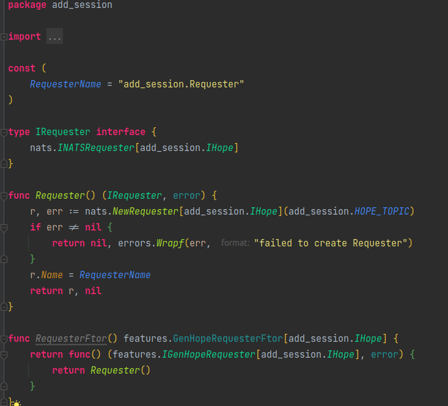

More code samples can be found under any `<Context>/command/client` folder.


#### Step 2: Receiving the IHope request
A CMD Service implements a behavior-centric bounded context, as opposed to many so-called micro-services that chose a data-centric approach. This means that a GO-SCREAM CMD Service supports a well-defined business process end-to-end. Such a business process (or behavior) is a complex sequence of actions ("commands"), that trigger at least one event each. A CMD service considers these commands as the entry points of the process and exposes these entry points by means of **Responders**. 
> As the counterpart for a *Requester*, a Responder is an active component, in the sense that it is *activated* at startup of the CMD Service, and *subscribes* to one specific topic on the async request/reply infrastructure.

Whenever a IHope request appears on this topic, the Responder will translate this IHope structure into an (internal) *ICmd* and instantiate a CommandHandler that will process the Icmd and return an IFbk structure as a result. Since a Responder processes a IHope, and creates a ICmd, it is discriminated for DI by these types, corresponding to the feature.

Please find below a typical implementation of a **Responder**


More code samples can be found under any `<Context>/command/features` directory.


#### Step 3: Handling the ICmd
>Processing of the internal ICmd structures is done by a **CommandHandler**. This is a transient component that is instantiated by the *Responder* and has the following responsibilities:
> - Accepting and Validating the incomming ICmd
> - from the ICmd's AggregateID, **source** all the events from the corresponding event stream (this is where the term 'Event Sourcing' originates from)
> - from this ordered collection of events, **build the current state**
> - using this current state, and combined with the aggregate's specifications, determine if the command is allowed to be executed
> - if yes, **execute the command**, which results in a *new* event that is 
> (a) *appended* to the event stream, 
> (b) *published* to the in-memory pub/sub infrastructure (*the mediator*) where it can be picked up by other feature-specific components.
> (c) *applied* to the current state
> - Finally, the new state is added to the IFbk as a Payload

GO-SCREAM applications are *feature*-sliced. This means that for each feature, we need to implement 2 artifacts: a *TryCmd* function and an *ApplyEvt* function

Please find below examples of these artifacts for *raiseEvent* (in try_cmd.go) and *applyEvt* (in apply_evt.go) respectively:

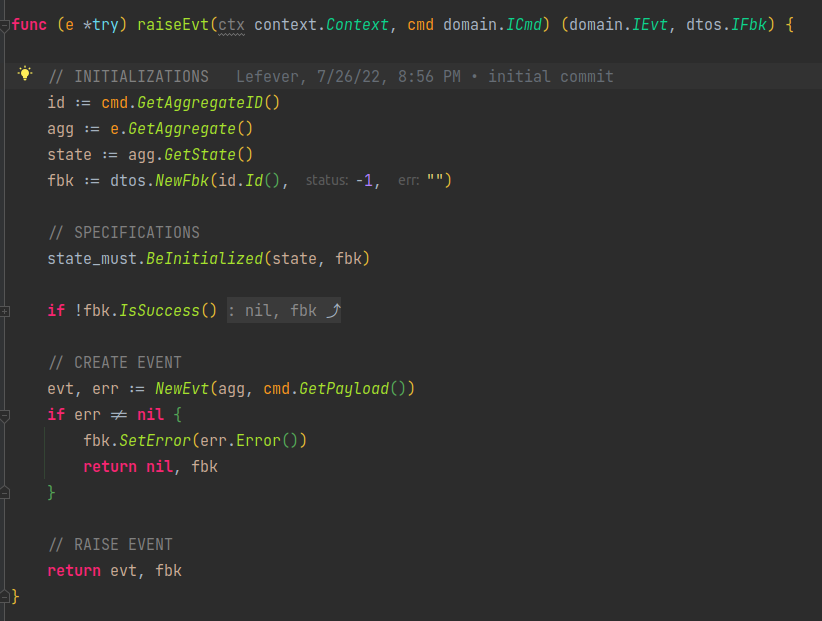

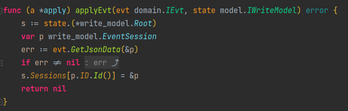

Further code samples can be found in the `<Context>/command/domain/<feature>` directories.

##### A few words on Idempotency
An Aggregate in ES is basically a state machine and its status is an important factor on whether an ICmd can be executed or not. When implementing a try_cmd.go component, it is important to check the aggregate's Root "Status" field, as a first enabler to implement idempotency for incomming commands. 
If so required by the use case, of course additional checks can be implemented.


#### Internal Event Processing
In the previous step, we described how a new event is also published to the mediator.
This offers us the option for additional processing of these events, using a family of components called **EventHandlers**.

##### Domain Links
These are **EventHandlers**, that *subscribe to mediator topics* and that allow us to process domain events, by triggering other command handlers. These domain links represent the internal connectors in the behavioral diagram. A **DomainLink** accepts an IEvt, translates it into an ICmd and instantiates a CommandHandler to process this command.
Here is an example of such a DomainLink

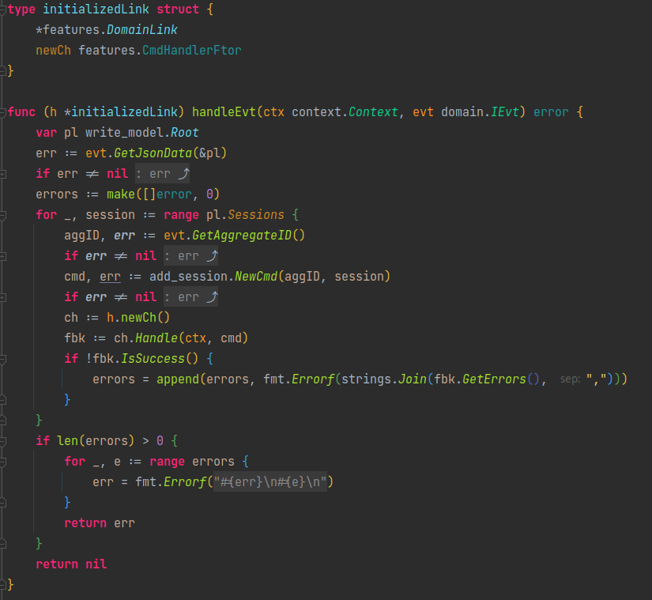

Additional code samples can be found in the `<Context>/command/features/<feature>` folders.

##### Emitters
Another type of component that can be useful, particularly for integration purposes, are **Emitters**. These are EventHandlers that subscribe to selected Mediator topics and translate the internal IEvt structs, to serializable IFact structs, which can then be published to other infrastructure. (i.e. Kafka)

Please find below an example of such an Emitter.

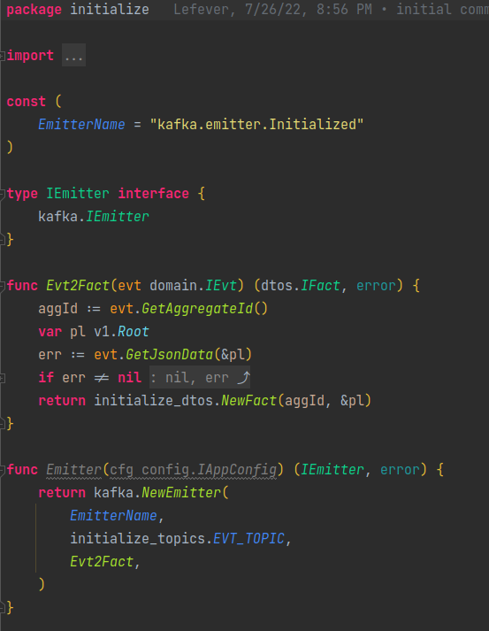

Additional sample code can be found in `<Context>/command/features/<feature>` directories.


#### Integrations
For integrating with external services or infrastructure, we propose the introduction of **Listeners**. These active components can subscribe to topics on some integration infrastructure, translate the received artifacts into ICmd structures and process these using the previously described *CommanHandler*.
At this point, we have no Listeners, so we cannot show any code samples, but should they appear, they will belong in the `<context>/command/features/<feature>` directories.


### Projection Sequence
Projections are an integral part of an ES/CQRS system and serve the purpose of interpreting events and mapping these to a desired *ReadModel*, usually by filling a database or a cache, that is optimized for reading. In our implementation, we use Redis, but given extra effort, any other type of database can be provisioned with data.

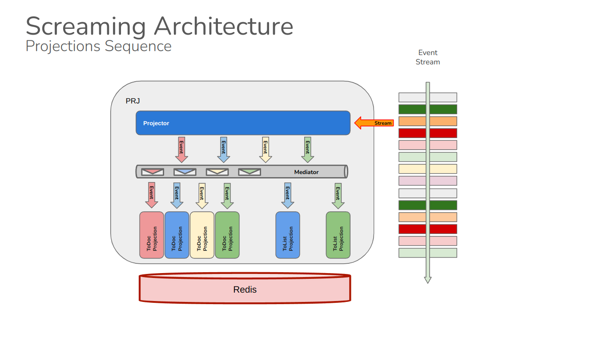

Here follows a description of what is happening in the diagram above.

#### Step 1: Extraction
A Go-SCREAM PRJ service includes the *MediatorProjector* component, that subscribes to EventStoreDB's event bus functionality and that listens for events. 
It's responsibilities are to manage the subscriptions and to publish inbound events to the Mediator.

#### Step 2: Transformation
The PRJ service implements a number of *Projection* components. These are active components, that subscribe to topics on the Mediator (one topic per Event) and map (transform) these events onto manipulations of the ReadModel.
A **Projection** has 3 dependencies: The extracted IEvt, the target ReadModel and the target infrastructure. 
**Transformations** are independent of the infrastructure but can be shared, so there housed in the *domain* shell.  
> Since we are using a Redis database, our basic building blocks are K/V pairs, 
> while an IReadModel is usually a document that describes a complex data structure.
> 
> Where a RBMS would require additional complexity to map this data structure 
> onto database tables, NoSQL -in this case a K/V store- offers a more direct approach, 
> which results in maintaining **Evt2Doc** and **Evt2List** transformations.

Here are examples of both.

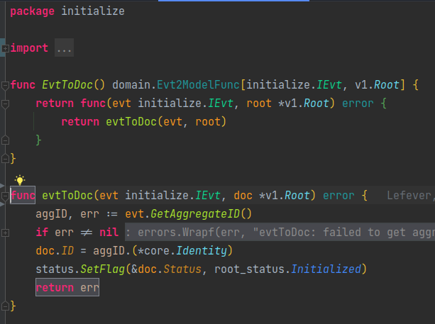

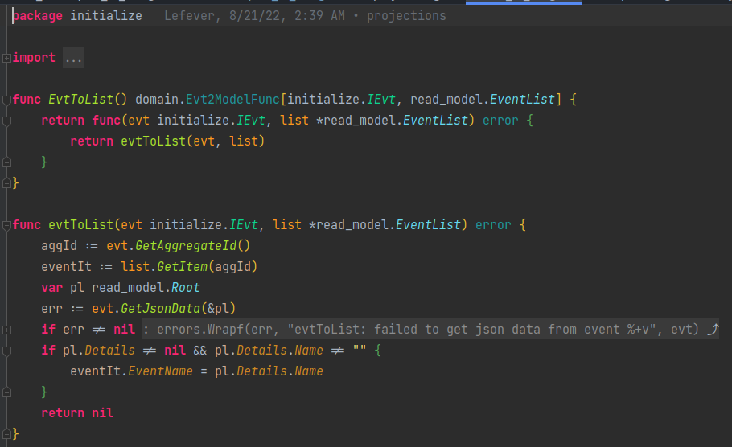

More code samples can be found in the `<context>/projection/domain/<feature>` directories.

#### Step 3: Load
It is important to remember, that a *Projection* has a dependency on the target infrastructure. This means that one will have to be injected for each target.

Here is a *Projection* implementation code sample.

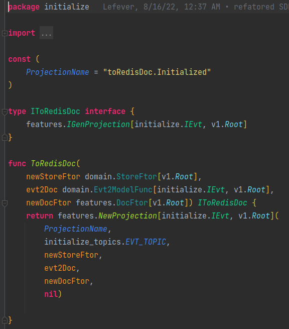

More examples may be found in the `<context>/projection/features/<feature>` directories.


## DEVELOPING GO-SCREAM Applications

### Setting up the local development environment

For local development, we recommend the [compose-dev-stack](https://github.com/rgfaber/compose-dev-stack). 
<br>
usage:
```bash
git clone https://github.com/rgfaber/compose-dev-stack
./run-minimal.sh -d
```

## SOME REFERENCES
- [Event Sourcing/CQRS - Greg Young](https://youtu.be/8JKjvY4etTY)
- [Event Storming - Alberto Brandolini](https://youtu.be/mLXQIYEwK24)
- [Microservices - Allard Buijze](https://youtu.be/jrbWIS7BH70)


## SERVERLESS DEPLOYMENT
One may notice that this architecture, due to its decoupled and modular nature, has many similarities with the concept of **Functions as a Service** (FaaS). One of the major issues that FaaS platforms struggle with is how to implement event sourced systems. This architecture does not pretend to have the solution for this problem, but **Agregate Composition** may offer a path forward. Should decomposing the Screaming Monolith into functional nanoservices become an option or a necessity one day, packaging each feature as a function and deploying it to a "serverless" infrastructure like OpenFaaS, should require minimal effort.